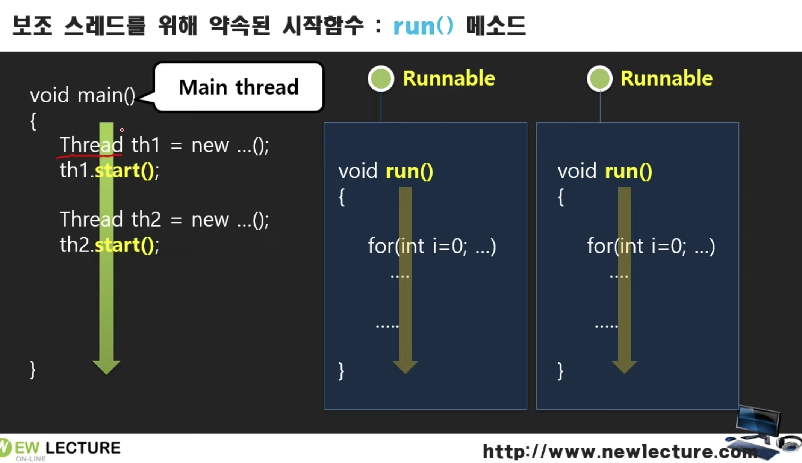
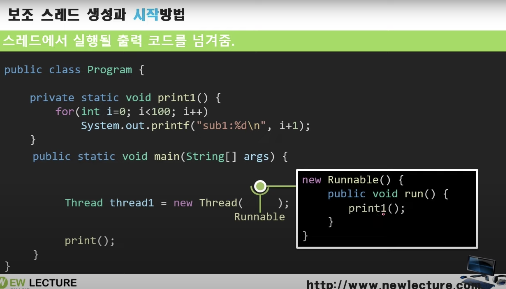

*\* 출처 : [[뉴렉처] 자바 스레드 강의](https://www.youtube.com/watch?v=haX-FQyfkhY&list=PLq8wAnVUcTFXCmfUPG5gZ-2KDzvIUJl-D)를 듣고 정리한 내용입니다.*


# 멀티 스레드

예제 준비

* 숫자 출력하는 프로그램
* 하나의 문맥을 가지고 동기 처리한다.
* 이 코드를 멀티 스레드 방식으로 비동기적으로 처리되도록 한다.

```java
public class Ex1Program {
    public static void main(String[] args) {
        print1();
        print2();
        for (int i = 0; i < 100; i++) {
            System.out.printf("main:%d\n", i + 1);
        }
    }

    private static void print1() {
        for (int i = 0; i < 100; i++) {
            System.out.printf("sub1:%d\n", i + 1);
        }
    }

    private static void print2() {
        for (int i = 0; i < 100; i++) {
            System.out.printf("sub1:%d\n", i + 1);
        }
    }
}
```

```tex
sub1:1
...
sub1:100
sub2:1
...
sub2:100
main:1
...
main:100
```

## 새로운 스레드로 print 메소드 호출하기

스레드(문맥)를 여러개 만들어서 개별적으로 동시에 실해되도록 한다.


* 자바에서는 `Thread` 클래스로 별도의 문맥을 만들 수 있다.
* `Runnable` 인터페이스
  * `run()` : 스레드의 흐름을 담당하는 시작부
  * `Runnable` 인터페이스를 구현해서 `run()`을 정의하고, `Thread` 생성시 DI해주면 된다.
* Thread의 `start()`를 호출해서 `run()`을 실행할 수 있다.
* `main`과 `th1`, `th2`가 시간을 나눠가면서 동시에 수행된다.




### 구현방법

* Runnable 인터페이스 구현체를 Thread 생성시 넣어준다.
  * 익명함수로 구현할 수 있다.

* Runnable 구현체에 정의된 `run()` 메소드가 별도의 스레드에서 실행된다.
* 반드시 `start()`를 호출해야 Thread가 실행되고 `run()`이 동작한다.




```java
public class Ex2Program {
    public static void main(String[] args) {
        Thread th1 = new Thread(new Runnable() { //Runnable 익명 함수 사용
            @Override
            public void run() {
                print1();
            }
        });
        th1.start(); //스레드 실행

        Thread th2 = new Thread(() -> print2()); //람다 표현식 사용
        th2.start();

        for (int i = 0; i < 100; i++) {
            System.out.printf("main:%d\n", i + 1);
        }
    }

    private static void print1() {
        for (int i = 0; i < 100; i++) {
            System.out.printf("sub1:%d\n", i + 1);
        }
    }

    private static void print2() {
        for (int i = 0; i < 100; i++) {
            System.out.printf("sub2:%d\n", i + 1);
        }
    }
}
```


번갈아가며 수행된다.

```tex
> Task :Ex2Program.main()
sub1:1
...
sub1:69
sub2:1
...
sub2:52
main:1
...
main:6
sub2:53
...
sub2:100
sub1:70
...
sub1:100
main:7
...
main:100
```


